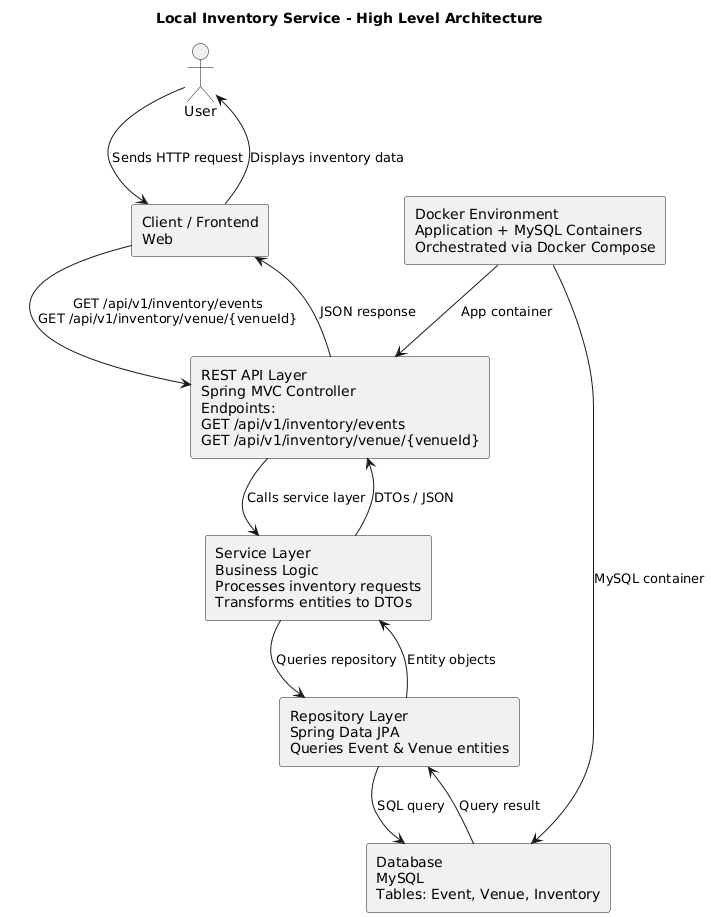

# Local Inventory Service

A Spring Boot microservice for managing event and venue inventory with real-time availability. Built for backend ticketing platforms to reliably serve event and venue data.

---

## Architecture

## Features

- **List Events:** Get all events with inventory status (capacity, available seats)
- **Venue Details:** Fetch venue info including location and capacity
- **Event-Venue Mapping:** Maintain consistent relationships between events and venues

- TO BE CONTINUED
---

## Tech Stack

| Layer | Technology |
|-------|-----------|
| **Language** | Java 20 |
| **Framework** | Spring Boot 3.x |
| **Web** | Spring MVC (REST APIs) |
| **Persistence** | Spring Data JPA + Hibernate |
| **Database** | MySQL 8.0 |
| **Migration** | Flyway |
| **Containerization** | Docker + Docker Compose |
| **Build** | Maven |
| **Utilities** | Lombok |

---

**Layered Approach:**  
Client → REST Controller → Service → Repository → MySQL
- **Controllers:** Handle HTTP requests and responses
- **Service Layer:** Business logic, data transformations, and validations
- **Repository Layer:** Database queries via JPA
- **Containers:** Docker Compose orchestrates the service and MySQL
